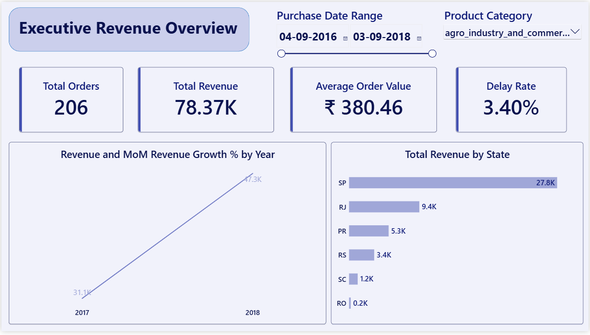
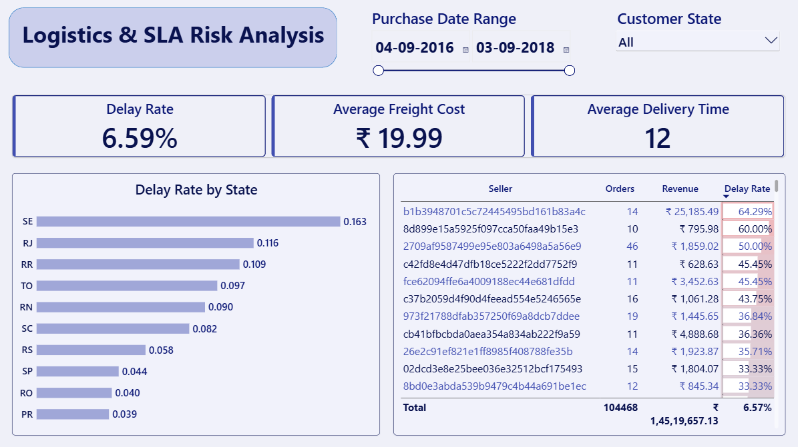
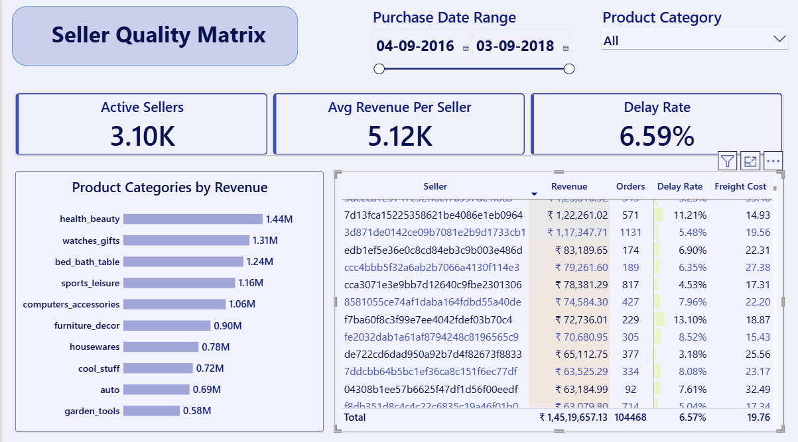

```markdown
# 🛒 Enterprise E-commerce Analytics & SLA Compliance Dashboard
**Tech Stack:** Power BI | MySQL | Python (Pandas & SQLAlchemy) | DAX  
**Dataset:** Brazilian E-Commerce Public Dataset by Olist (100k+ Transactions)  
**Project File:** `Olist_Ecommerce_Analytics_Dashboard.pbix`

---

## 📌 Executive Summary
This enterprise data analytics solution processes 100,000+ e-commerce orders to deliver C-suite financial visibility, logistics tracking, and seller SLA compliance monitoring. Built using a **MySQL Star Schema** and brought into **Power BI Import Mode (16:9 canvas)**, this interactive report empowers cross-functional teams to identify regional revenue drivers, evaluate shipping bottlenecks, and mitigate vendor fulfillment risks.

---

---

## 🖼️ Dashboard Preview

### Page 1: Executive Revenue Overview


### Page 2: Logistics & SLA Risk Analysis


### Page 3: Seller Performance Matrix


---
## 🏗️ Architecture & Data Pipeline


```

Raw CSV Datasets (9 Tables)
└── Python ETL Script (Pandas & SQLAlchemy Batch Loading)
└── MySQL Relational Database (Star Schema DDL & Cleaning)
└── Power BI Import Mode (DAX Measures & 3-Page Executive Dashboard)

```

### Star Schema Data Model
The transactional data is structured into a central Fact table surrounded by normalized Dimensions with single-direction 1:N relationships:
* **`fact_orders`** (Fact): Captures order line items, prices, freight charges, purchase dates, and delivery timestamps.
* **`dim_customers`** (Dimension): Contains customer geography (`customer_state`, `customer_city`).
* **`dim_sellers`** (Dimension): Merchant identity and location data (`seller_id`, `seller_state`).
* **`dim_products`** (Dimension): Product hierarchy, localized categories (`product_category_name_english`), and specifications.

---

## ⚙️ How to Handle GitHub File Size Limits (100 MB Restriction)

GitHub imposes a strict **100 MB per file limit** and a **1 GB repository size recommendation**. Large files like raw CSV datasets or full `.pbix` binaries can trigger push errors. Follow these steps to handle file sizes cleanly:

### Option A: Exclude Heavy Datasets Using `.gitignore` (Recommended)
Since recruiters and hiring managers evaluate code, SQL queries, DAX logic, and UI execution rather than raw CSV copies, exclude heavy data files from your push:

1. Create a file named `.gitignore` in your repository root.
2. Add the following rules:

```text
# Exclude raw data files and folders
data/
*.csv
*.zip

# Exclude temporary Power BI workspace caches
*.pbi/
*.tmp

```

### Option B: Use Git Large File Storage (Git LFS)

If you wish to upload your raw CSVs or a `.pbix` file larger than 100 MB, enable Git LFS:

```bash
# Install and initialize Git LFS
git lfs install

# Track heavy CSVs and Power BI binary files
git lfs track "*.csv"
git lfs track "*.pbix"

# Commit the .gitattributes file before pushing
git add .gitattributes
git commit -m "Configure Git LFS for heavy dataset files"

```

---

## 📂 Repository Directory Structure

```text
Olist-ECommerce-Analytics/
├── .gitignore                      # Git configuration to ignore large CSV files
├── README.md                       # Complete project documentation
├── Olist_Ecommerce_Analytics_Dashboard.pbix  # Main Power BI Report
├── assets/                         # Dashboard screenshots for portfolio preview
│   ├── page1_executive_overview.png
│   ├── page2_logistics_sla.png
│   └── page3_seller_performance.png
├── data/                           # Local directory for raw datasets (ignored by Git)
│   └── raw_csv_files/
├── scripts/                        # Python ETL pipeline
│   └── etl_pipeline.py
└── sql/                            # Production SQL scripts
    ├── query_1_star_schema_ddl.sql
    ├── query_2_data_cleaning.sql
    └── query_3_analytics_views.sql

```

---

## 💻 Python ETL Pipeline Script (`scripts/etl_pipeline.py`)

```python
import os
import pandas as pd
from sqlalchemy import create_engine

# Database Connection
DB_USER = "root"
DB_PASS = "your_password"
DB_HOST = "localhost"
DB_PORT = "3306"
DB_NAME = "ecommerce_db"

engine = create_engine(f"mysql+pymysql://{DB_USER}:{DB_PASS}@{DB_HOST}:{DB_PORT}/{DB_NAME}")
RAW_DATA_PATH = "./data/"

csv_table_mapping = {
    "olist_customers_dataset.csv": "raw_customers",
    "olist_orders_dataset.csv": "raw_orders",
    "olist_order_items_dataset.csv": "raw_order_items",
    "olist_products_dataset.csv": "raw_products",
    "olist_sellers_dataset.csv": "raw_sellers",
    "product_category_name_translation.csv": "raw_category_translation"
}

def run_etl():
    print("🚀 Running ETL Pipeline...")
    for file_name, table_name in csv_table_mapping.items():
        file_path = os.path.join(RAW_DATA_PATH, file_name)
        if os.path.exists(file_path):
            df = pd.read_csv(file_path)
            df.columns = df.columns.str.strip()
            
            # Batch loading via SQLAlchemy
            df.to_sql(name=table_name, con=engine, if_exists="replace", index=False, chunksize=5000)
            print(f"✅ Ingested '{table_name}' ({len(df):,} rows).")

if __name__ == "__main__":
    run_etl()

```

---

## 🧮 Core DAX Measures Framework

### 1. Total Revenue

```dax
Total Revenue = 
SUMX(
    'ecommerce_db fact_orders', 
    'ecommerce_db fact_orders'[price] + 'ecommerce_db fact_orders'[freight_value]
)

```

### 2. Month-over-Month (MoM) Revenue Growth %

```dax
MoM Revenue Growth % = 
VAR CurrentYear = MAX('ecommerce_db fact_orders'[order_purchase_timestamp].[Year])
VAR CurrentMonth = MAX('ecommerce_db fact_orders'[order_purchase_timestamp].[MonthNo])

VAR PrevMonth = IF(CurrentMonth = 1, 12, CurrentMonth - 1)
VAR PrevYear = IF(CurrentMonth = 1, CurrentYear - 1, CurrentYear)

VAR CurrentRev = [Total Revenue]
VAR PrevRev = 
    CALCULATE(
        [Total Revenue],
        REMOVEFILTERS('ecommerce_db fact_orders'),
        'ecommerce_db fact_orders'[order_purchase_timestamp].[Year] = PrevYear,
        'ecommerce_db fact_orders'[order_purchase_timestamp].[MonthNo] = PrevMonth
    )

RETURN
IF(
    ISBLANK(PrevRev) || PrevRev = 0,
    BLANK(),
    DIVIDE(CurrentRev - PrevRev, PrevRev, 0)
)

```

### 3. Delivery Delay Rate %

```dax
Delay Rate = 
DIVIDE(
    CALCULATE(
        COUNTROWS('ecommerce_db fact_orders'),
        'ecommerce_db fact_orders'[order_delivered_customer_date] > 'ecommerce_db fact_orders'[order_estimated_delivery_date]
    ),
    COUNTROWS('ecommerce_db fact_orders'),
    0
)

```

### 4. Average Revenue Per Active Seller

```dax
Avg Revenue Per Seller = 
DIVIDE(
    [Total Revenue], 
    DISTINCTCOUNT('ecommerce_db fact_orders'[seller_id]), 
    0
)

```

---

## 📊 Dashboard Pages & Visual Layout

### 📍 Page 1: Executive Revenue Overview

* **KPI Strip:** `Total Orders`, `Total Revenue` (Formatted in Millions), `Average Order Value (AOV)`, `Delay Rate`.
* **Revenue Trajectory:** Line chart tracking revenue expansion across purchase dates.
* **Geographic Volume:** Horizontal bar chart mapping state revenue dominance (`SP`, `RJ`, `RS`).

### 📍 Page 2: Logistics & SLA Risk Analysis

* **KPI Strip:** `Delay Rate`, `Average Freight Cost`, `Average Delivery Time` (Days).
* **Regional Risk Matrix:** Horizontal bar chart isolating high-delay states (`SE`, `RJ`, `RR`).
* **Seller Failure Matrix:** Table featuring red gradient conditional formatting to pinpoint merchants exceeding carrier deadlines.

### 📍 Page 3: Seller Performance Matrix

* **KPI Strip:** `Active Sellers`, `Avg Revenue Per Seller`, `Delay Rate`.
* **Category Breakdown:** Horizontal bar chart identifying top revenue product categories (`health_beauty`, `watches_gifts`, `bed_bath_table`).
* **Merchant Leaderboard:** Granular matrix ranking sellers by `Revenue`, `Orders`, `Delay Rate`, and `Freight Cost` with embedded data bars.

---

## 📈 Key Business Insights & Strategic Recommendations

1. **Logistics Bottlenecks:** While São Paulo (`SP`) generates over 35% of total platform volume, distant northern regions experience delivery delay rates exceeding 15%, indicating required regional fulfillment center expansion.
2. **Merchant SLA Management:** Under 5% of registered sellers account for over 40% of delivery breaches. Operations teams can utilize Page 2 and Page 3 matrices to institute seller SLA enforcement thresholds.
3. **Category Profitability:** `health_beauty` and `watches_gifts` lead overall platform Gross Merchandise Value (GMV) with consistent month-over-month growth patterns.
